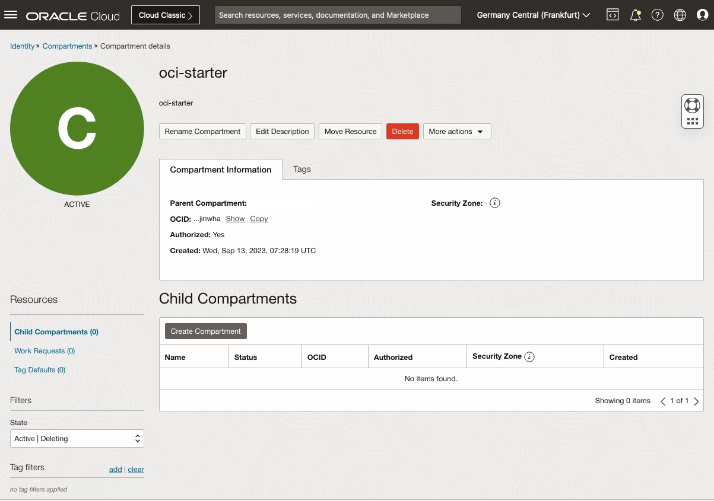
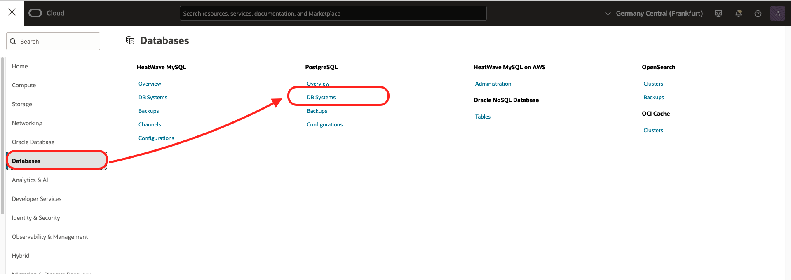
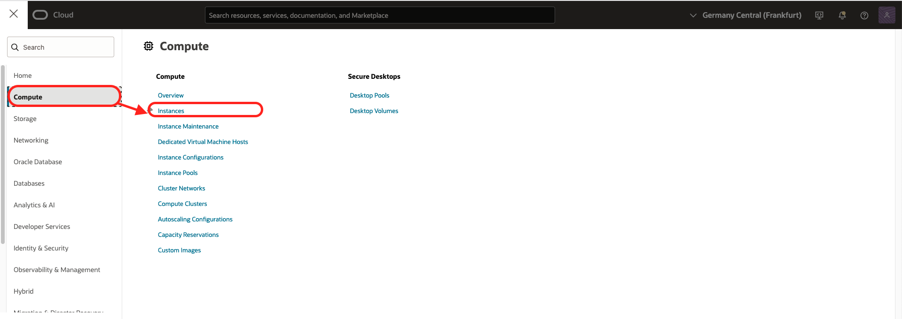
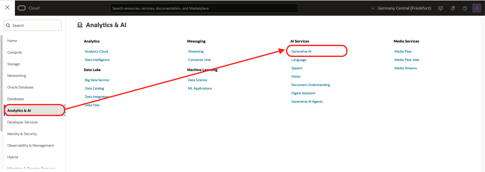

# Discover services that have been created by automation and that comprise the solution

## Introduction
In this optional lab you can explore services that have been created by automation and that comprise the solution such as the AI services and PostgreSQL. We will also explore the Schema for the Database.

Estimated time: 20 min

### Objectives

- Discover services that have been created by automation and that comprise the solution

### Prerequisites
- You've completed the previous labs

## Task 1: Compartment

The compartment is used to contains all the components of the lab.
From an architectural viewpoint, a compartment is simply a logical group of OCI resources. There is no specific implication of network structure, geographical placement, or even any relationship between resources. They are merely a set of resources that are associated with a set of group based permissions.

Go the Cloud console 3-bar/hamburger menu and select the following
  1. Identity & Security
  2. Choose Compartment
    
 
  3. Click on the compartment name ***oci-starter***
     
   

## Task 2: Virtual Cloud Network

The Virtual Cloud Network allows you to manage the network of the components.
A virtual cloud network (VCN) is a virtual, private network that closely resembles a traditional network, with firewall rules and specific types of communication gateways that you can choose. A VCN resides in a single OCI region and covers one or more CIDR blocks (IPv4 and IPv6, if enabled). Each subnet consists of a contiguous range of IP addresses (for IPv4 and IPv6, if enabled) that do not overlap with other subnets in the VCN.

Go the Cloud console 3-bar/hamburger menu and select the following
  1. Networking
  2. Virtual Cloud Network

   

  3. Check that you are in the right compartment (oci-starter in this case)
  4. Click on vcn name *vcn1*
  5. Notice two subnets: psql-priv-subnet Private (Regional) and pub-subnet Public (Regional). 
You can designate a subnet as either public or private when you create it. Private means VNICs in the subnet can't have public IPv4 addresses and internet communication with IPv6 endpoints will be prohibited. Public means VNICs in the subnet can have public IPv4 addresses and internet communication is permitted with IPv6 endpoints.
    
  7. Choose *Security* and scroll down to the security lists
  8. Then click on *VCN1-PRIVATE-SL* and *VCN1-PUBLIC-SL*
  9. Notice Ingress Rules that were created for this lab

*VCN1-PRIVATE-SL* 
  
````
       Source CIDR: *10.0.0.0/16*, Destination Port: *22* /required for accessing SSH in the same VCN 
       Source CIDR: *10.0.0.0/16*, Destination Port: *5432* /required for accessing PostgreSQL from a compute instance in the same VCN
````

*VCN1-Public-SL*
  
  
````
       Source CIDR: *0.0.0.0/0*, Destination Port: *22* /required for accessing SSH from the internet  
       Source CIDR: *0.0.0.0/0*, Destination Port: *8000* /required for accessing application from the internet       
       Source CIDR: *0.0.0.0/0*, Destination Port: *8443* /required for accessing application from the internet   
       Source CIDR: *0.0.0.0/0*, Destination Port: *9000* /required for accessing application from the internet    
       Source CIDR: *0.0.0.0/0*, Destination Port: *443* /required for accessing https from the internet
````
       
## Task 3: PostgreSQL Database System

OCI Database with PostgreSQL allows us to store extracted text from documents including their corresponding vector embeddings by using the pgvector extension so we can perform a semantic search. Database with PostgreSQL is a fully managed PostgreSQL service with intelligent sizing, tuning and high durability.

Go the Cloud console 3-bar/hamburger menu and select the following
  1. Database
  2. PostreSQL - DB Systems

  

  3. Check that you are in the right compartment (oci-starter in this case)
  4. Click on the PostgreSQL db system name *psql_inst_1*
  5. Notice the General information:  
  Performance tier: 75K IOPS
  Shape: VM.Standard.E5.Flex
  OCPU count: 2
  RAM(GB): 32

  6. Notice Network configuration
  7. Notice Connection details
  8. Notic the psql configuration which has the AI extensions *livelab_flexible_configuration*
  9. Notice Database system nodes
A Database system is PostgreSQL database cluster running on one or more OCI VM Compute instances. A database system provides an interface enabling the management of tasks such as provisioning, backup and restore, monitoring, and so on. Each database system has one endpoint for read/write PSQL queries and can have multiple endpoints for read-only queries.

  


## Task 4: Compute Instance

Compute instance is used to host the application logic.

   1. Explore the Compute instance details    
    1. Go the Cloud console 3-bar/hamburger menu and select the following    
        1. Compute
        2. Instances
    
    
    2. Check that you are in the intended compartment. (*oci-starter* was the recommended compartment name.)
    3. Click **app-host-1** in the Compute instances list
    4. Review the information on the Compute instance details page 

    

## Task 5: OCI GenAI Service

OCI Generative AI provides access to pretrained, foundational models from Cohere, OpenAI, Google, and Meta. It also provides dedicated AI clusters, where you can host foundational models on dedicated GPUs that are private to you. These clusters provide stable, high-throughput performance that’s required for production use cases and can support hosting and fine-tuning workloads. OCI Generative AI enables you to scale out your cluster with zero downtime to handle changes in volume.

In this step you will explore the AI Services that are leveraged in the solution. 

   1. Explore the Generative AI Service used in the solution. Common use cases of the Generative AI Service include: Create text for any purpose, Extract data from text, Summarize articles, transcripts, and more. Classify intent in chat logs, support tickets, and more. Rewrite content in a different style or language.    
    1. Go the Cloud console 3-bar/hamburger menu and select the following    
        1. Analytics & AI
        2. AI Services
        3. Select Generative AI

      
        
        OCI Generative AI offers several playground modes, each with ready-to-use pretrained models:
            Generation: Generates text or extracts information from text
            Summarization: Summarizes text with specified format, length, and tone
            Embedding: Converts text to vector embeddings to use in applications for semantic searches, text classification, or text clustering
The Generative AI model available in your regions can be listed from the **Playground** > **Chat** tab
      

When you click on the model details you get the model OCID which is used the the environment variable file of the application to perform the inference in the RAG pipeline

  

If you want to try a different model, you can select a model from this menu, copy its OCID and paste it in the environment file and restart the App stack.

## Task 6: PostgreSQL Schema

The Application stores the vctor embeddings and metadata related to the files in 2 tables **documents** **chunks**

````
postgres=> \dt
           List of relations
 Schema |   Name    | Type  |  Owner
--------+-----------+-------+----------
 public | chunks    | table | postgres
 public | documents | table | postgres
(2 rows)
````

````
postgres=> \d documents
                                       Table "public.documents"
   Column    |           Type           | Collation | Nullable |                Default
-------------+--------------------------+-----------+----------+---------------------------------------
 id          | bigint                   |           | not null | nextval('documents_id_seq'::regclass)
 source_path | text                     |           |          |
 source_type | text                     |           | not null |
 title       | text                     |           |          |
 metadata    | jsonb                    |           |          | '{}'::jsonb
 created_at  | timestamp with time zone |           |          | now()
Indexes:
    "documents_pkey" PRIMARY KEY, btree (id)
Referenced by:
    TABLE "chunks" CONSTRAINT "chunks_document_id_fkey" FOREIGN KEY (document_id) REFERENCES documents(id) ON DELETE CASCADE
````

````
postgres=> \d chunks
                                                            Table "public.chunks"
     Column      |           Type           | Collation | Nullable |                                 Default

-----------------+--------------------------+-----------+----------+--------------------------------------------------------------------
-----
 id              | bigint                   |           | not null | nextval('chunks_id_seq'::regclass)
 document_id     | bigint                   |           | not null |
 chunk_index     | integer                  |           | not null |
 content         | text                     |           | not null |
 content_tsv     | tsvector                 |           |          | generated always as (to_tsvector('english'::regconfig, content)) st
ored
 content_chars   | integer                  |           |          |
 embedding       | vector(384)              |           |          |
 embedding_model | text                     |           |          |
 created_at      | timestamp with time zone |           |          | now()
Indexes:
    "chunks_pkey" PRIMARY KEY, btree (id)
    "idx_chunks_doc_chunk" UNIQUE, btree (document_id, chunk_index)
    "idx_chunks_embedding_ivfflat" ivfflat (embedding vector_cosine_ops) WITH (lists='1000')
    "idx_chunks_tsv" gin (content_tsv)
Foreign-key constraints:
    "chunks_document_id_fkey" FOREIGN KEY (document_id) REFERENCES documents(id) ON DELETE CASCADE
````

**content_tsv** is the full text search data stored in the FTS format for PostgreSQL

**embedding** is the vector data type with 384 dimensions reflecting the dimensions of the embedding models. For more accuracy you can select a different embedding model and a higher dimension.

**Congratulations! You have completed this workshop.**

Here's what you accomplished. You explored multiple services in a compartment in your OCI tenancy. These included OCI VCN, Compute, OCI GenerativeAI, and OCI PostgreSQL Databae System. This lab has illustrated how different OCI services can be integrated together to make a complete cloud native AI search solution.

## Acknowledgements

- **Created By/Date** - Shadab Mohammad, Master Principal Cloud Architect, January 2026
- **Last Updated By** - Shadab Mohammad, January 2026


